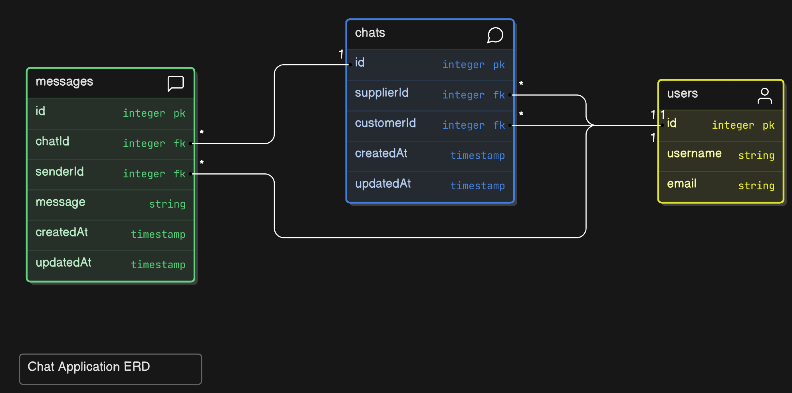

# LLM PDF Analysis Application

## Overview

This repository contains an application designed to analyze PDF files using a large language model (LLM) to ensure high accuracy and reliability through Retrieval-Augmented Generation (RAG) techniques. The application leverages ChatGPT-4 for its language processing capabilities and includes customizable personas to alter the behavior and focus of the analysis.

## Features

- **PDF File Analysis:** Analyzes content within PDF files, providing comprehensive and accurate insights.
- **High Accuracy:** Utilizes Retrieval-Augmented Generation (RAG) to enhance the accuracy and reliability of the generative AI model.
- **Advanced Language Model:** Powered by ChatGPT-4o, a state-of-the-art language model for natural language understanding and generation.
- **Customizable Personas:** Choose from various personas to change how ChatGPT-4 responds and what it looks for in files, tailoring the analysis to specific needs.

## Technologies Used

### Frontend

- **React:** A JavaScript library for building user interfaces.
- **TypeScript:** A strongly typed programming language that builds on JavaScript.

### Backend

- **PostgreSQL:** A powerful, open-source object-relational database system.
- **TypeScript:** Used for writing the backend server logic.

### LLM API

- **Python:** The LLM API is implemented in Python to interface with ChatGPT-4.

## Deployment

- **Google Cloud Platform (GCP):** The application servers are hosted on GCP virtual machines, ensuring scalability and reliability.

### Schema

